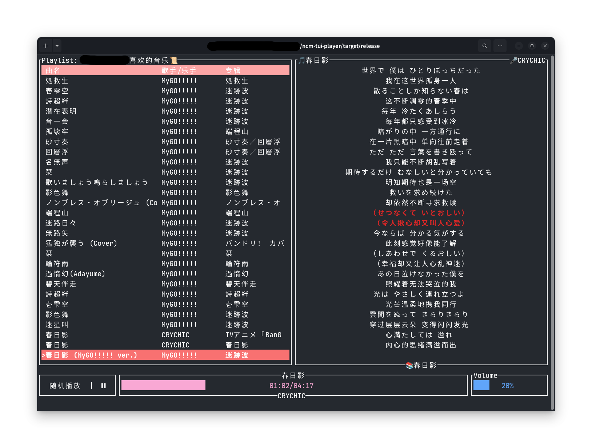

# ncm-tui-player

本项目是一款用 rust 编写的网易云音乐终端界面播放器。

提供与 `Vim` 相仿的命令和交互。

tui 界面基于 `ratatui` crate 开发。

## UI 展示

## 编译

### Windows

#### 一、安装依赖和编译工具

1. `pkg-config` : [前往下载](https://gitcode.com/open-source-toolkit/04bca/blob/main/pkg-config-lite-0.28-1_bin-win32_2022%E6%9C%80%E6%96%B0%E7%89%88.zip)【解压到硬盘根目录】
2. `cargo` : [官方文档](https://rustwiki.org/zh-CN/cargo/getting-started/installation.html)【均输入1等待安装完成】
3. `Gstreamer` : [前往下载](https://gstreamer.freedesktop.org/download)【安装`MSVC 64-bit`，`runtime`和`development`均需要安装，安装时选择】
4. `OpenSSL` : [前往下载](https://slproweb.com/products/Win32OpenSSL.html)【选择最新版但不带light版本】

#### 二、配置环境变量
1. 将`pkg-config`的`bin`路径添加到`Path`环境变量中，例如：`D:\pkg-config\bin`
2. 配置`OPENSSL_DIR`环境变量，例如：`D:\Program Files\OpenSSL-Win64`
... 有空在写

## Features 列表

- [x] 扫码登录
- [x] Cookie 登录
- [x] 获取用户的“喜欢的音乐”歌单
- [ ] 获取用户收藏的歌单
- [ ] 切换歌单
- [ ] 通过api搜索歌曲
- [ ] 查看专辑
- [ ] 查看歌手
- [ ] 喜欢 / 取消喜欢 / 收藏 / 取消收藏
- [ ] 加入当前播放列表 / 下一首播放
- [x] 歌词显示
- [x] 音量设置 / “一键静音”
- [x] 单曲播放 / 单曲循环播放 / 列表循环播放 / 随机播放
- [x] “一键开始播放”
- [x] 下一首 / 上一首
- [x] 跳转到某句歌词对应的时间戳播放
- [x] 在歌单中跳转到当前播放的歌曲所在位置
- [x] 在歌单中搜索歌曲名
- [ ] 使用正则表达式搜索歌曲名
- [ ] 自定义Style
- [ ] 设置页面
- [ ] 用户数据缓存
- [ ] Linux各发行版和Windows打包分发

欢迎提 Issue 或 PR :)

## 参考项目

### api 参考：

https://github.com/gmg137/netease-cloud-music-api

https://github.com/gmg137/netease-cloud-music-gtk

### tui 参考：

https://gitlab.com/jcheatum/rmup

https://github.com/aome510/spotify-player

https://github.com/Rigellute/spotify-tui

https://github.com/sudipghimire533/ytui-music

https://github.com/tramhao/termusic